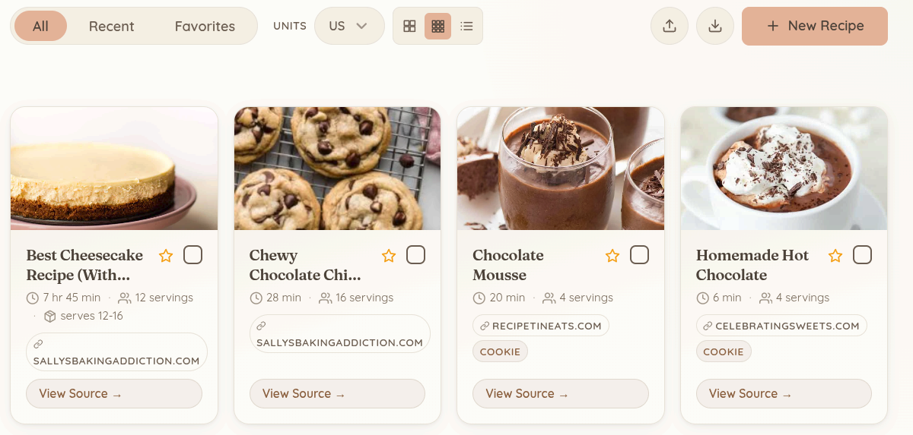
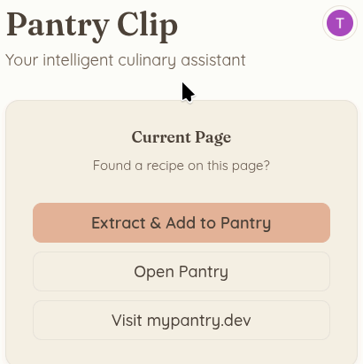
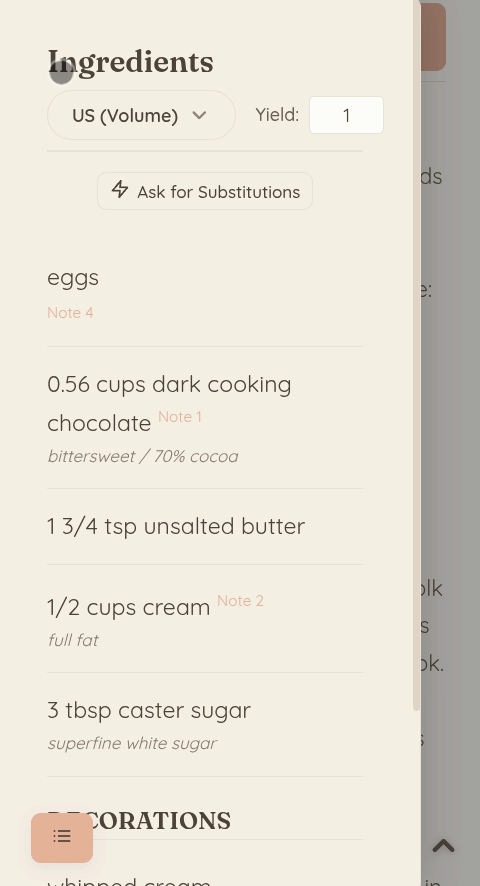

<div align="center">
  <a href="https://chromewebstore.google.com/detail/my-pantry/hhaplljlbkgehhomjkjdnadbjpcahglo" target="_blank">
    
  </a>
</div>

# MyPantry

 

**[Visit Our Homepage: mypantry.dev](https://mypantry.dev)**

**MyPantry** (Extension Name: **Pantry Clip**) is a privacy-first, hybrid-architecture recipe assistant. It consists of a minimal-permission browser extension acting as the edge client, and a rate-limited Python FastAPI backend for cloud synchronization and LLM orchestration. 

## 📸 Visual Showcase

<div align="center">
  <h3>The Main Dashboard</h3>
  
  <br><br>
  <table width="100%">
    <tr>
      <td align="center" width="50%">
        <b>Extension Popup</b><br>
        
      </td>
      <td align="center" width="50%">
        <b>Mobile Ingredients</b><br>
        
      </td>
    </tr>
  </table>
</div>

The system leverages on-device edge AI for computing vector embeddings, enabling zero-cost backend scaling while keeping all user data perfectly private. It supports a fully local **Bring Your Own Key (BYOK)** mode as well as a **Freemium Cloud-Synced** mode powered by Google OAuth.

---

## 🏗️ Architecture Overview

The project is structured as a monorepo containing two main applications:

1. **Client Extension (`/apps/extension`)**: A Manifest V3 Chrome extension built with **Astro**. It handles local UI rendering, DOM extraction, and running local AI models.
2. **Cloud API (`/apps/api`)**: A **FastAPI** Python server managed by `uv`. It strictly acts as a secure router, rate limiter, and LLM proxy.

### Tech Stack
- **Extension Framework**: Astro (HTML/JS/TS) with scoped SCSS styling and `@mozilla/readability` for DOM parsing.
- **Extension Tooling**: Managed via `pnpm` and built for Manifest V3.
- **Edge AI**: `Transformers.js` executing local vector generation using quantized models (like Snowflake/snowflake-arctic-embed-s int4) via WASM in a `chrome.offscreen` document.
- **Local Database**: Semantic search is powered by `Orama`, persisted to `IndexedDB` on the client device. Vectors are stored locally, not in the cloud.
- **Backend API**: FastAPI (Python 3.10+), managed by the `uv` package manager, and utilizing `loguru` for structured telemetry.
- **LLM Integrations**: Directly utilizing Claude and Gemini provider APIs using Structured Outputs (no heavy abstraction frameworks).
- **Database & Auth**: Supabase (Postgres & Google OAuth). *Note: Vectors are strictly computed and stored locally on the client-side; Supabase is solely used for cloud backup state and does not use `pgvector`.*
- **Rate Limiting**: Upstash (Serverless Redis) for robust, token-bucket abuse prevention.
- **Security Layer**: Native Web Crypto API (`PBKDF2` + `AES-GCM`) for fully local, encrypted API key storage.

---

## ✨ Core Workflows & Optimizations

### 1. Hybrid Extraction (`/api/extract`)
When a user clips a recipe, the extension attempts a 3-tier waterfall extraction:
1. **Tier 1 (Structured):** Queries `application/ld+json` for the `@type: "Recipe"` schema.
2. **Tier 2 (Targeted DOM):** Searches specifically for recipe cards/classes if structured data is missing.
3. **Tier 3 (Fallback):** Injects `Readability.js` to aggressively prune boilerplate HTML and grab the core article.

The data is then sent to the backend, which proxies it through `gemini-2.5-flash` or `claude-3-5-sonnet` (using Structured Outputs) to normalize the recipe into a strict JSON schema.

### 2. Edge Vectorization
To drastically reduce cloud overhead, **the backend never calculates embeddings**. Instead, the extension calculates a mathematical vector array representing the recipe directly on the user's device using `Transformers.js` (quantized models). This process executes inside a dedicated `chrome.offscreen` document to bypass service-worker execution limits.

### 3. Agentic Substitution (`/api/substitute`)
Users can ask for ingredient substitutions. The backend passes the active recipe context to the LLM, prompting it to analyze the chemical properties of the target ingredient (e.g., binding, leavening, moisture) and compute a mathematically adjusted substitute.

### 4. Zero-Compute Cloud Sync
If the user authenticates via Supabase (Google OAuth), the extension pushes its JSON recipe backups to the Python API. The backend strictly routes this to standard Supabase Postgres for backup without executing any server-side AI compute and without needing expensive vector database instances.

---

## 🚀 Getting Started

### Prerequisites
- [Node.js](https://nodejs.org/) (v18+) & [pnpm](https://pnpm.io/)
- [Python 3.10+](https://www.python.org/) & [uv](https://github.com/astral-sh/uv)
- A [Supabase](https://supabase.com/) project (using standard Postgres)
- An [Upstash Redis](https://upstash.com/) database
- Standard API Keys to testing (Gemini, Anthropic, etc.)

### 1. Backend Setup (`/apps/api`)
```bash
cd apps/api
cp .env.example .env
```
Fill out the variables in `.env` (`SUPABASE_URL`, `SUPABASE_SERVICE_ROLE_KEY`, `UPSTASH_REDIS_REST_URL`, etc.).

```bash
uv venv
source .venv/bin/activate
uv pip install -r pyproject.toml
fastapi dev src/main.py
```

### 2. Extension Setup (`/apps/extension`)
```bash
cd apps/extension
cp .env.example .env
```
Ensure `PUBLIC_SUPABASE_URL` and `PUBLIC_SUPABASE_ANON_KEY` are set.

```bash
pnpm install
pnpm build
```

### 3. Loading the Extension
1. Open Google Chrome and navigate to `chrome://extensions/`.
2. Enable **Developer mode** in the top right.
3. Click **Load unpacked** and select the `apps/extension/dist` directory.
4. The Extension will automatically open the Onboarding/Setup page.

---

## 🔒 Security & Privacy Model
- **Strict Permission Scoping**: Requires only `"activeTab"`, `"scripting"`, `"storage"`, and `"offscreen"`. Does *not* request `<all_urls>`.
- **Local Key Encryption**: In BYOK mode, user-provided API keys are encrypted at rest in `chrome.storage.local` using an AES-GCM key derived from a session password.
- **Fail-Safe Export**: The dashboard includes an export/import feature, ensuring users retain total ownership of their recipe JSON data regardless of cloud connectivity.
- **Isolated Sandboxing**: Operations that require high compute are walled off in Chrome's background service worker and offscreen documents, keeping the visible DOM lightweight and snappy.

---

## 🎨 Brand Identity

- **Name**: MyPantry / Pantry Clip
- **Design Philosophy**: Utility-focused, Engineering-chic. Minimalist UI with "NYT Cooking" inspired aesthetics.
- **Typography**: `Fraunces` (headings) / `Quicksand` (body) / Monospace (data).
- **Core Colors**: 
  - Accent: `#E5B299` (Warm Apricot)
  - Primary: `#4A4036` (Espresso)
  - Background: `#FDFBF7` (Vanilla Cream)
