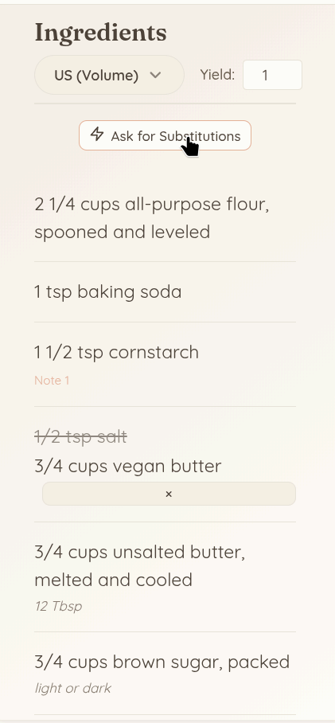

<div align="center">
  <a href="https://chromewebstore.google.com/detail/my-pantry/hhaplljlbkgehhomjkjdnadbjpcahglo" target="_blank">
    
  </a>
</div>

# MyPantry

 

**[Visit Our Homepage: mypantry.dev](https://mypantry.dev)**

**MyPantry** (Extension Name: **Pantry Clip**) is a privacy-first recipe clipper and assistant. Clip any recipe from the web with one click, search your collection semantically, scale ingredients, convert units, and get AI-powered substitutions — all with your data stored locally on your device.

---

## 📸 Visual Showcase

<div align="center">
  <h3>The Main Dashboard</h3>
  
  <br><br>
  <table width="100%">
    <tr>
      <td align="center" width="33%">
        <b>Extension Popup</b><br><br>
        
      </td>
      <td align="center" width="33%">
        <b>Ingredient Substitutions</b><br><br>
        
      </td>
      <td align="center" width="33%">
        <b>Mobile Ingredient View</b><br><br>
        
      </td>
    </tr>
  </table>
</div>

---

## ✨ Features

### One-Click Recipe Saving
Click the extension icon on any recipe page and hit **Extract & Add to Pantry**. The extension reads the page DOM, sends it to an LLM for normalization, and saves a clean structured recipe to your local library — ingredients, instructions, tags, source URL, and all. No copy-pasting.

### Semantic Search
Search your pantry using natural language. The extension computes a 384-dimensional vector embedding for every recipe entirely on your device using `Transformers.js` and a quantized Snowflake embedding model. Search combines BM25 full-text matching with cosine vector similarity (hybrid mode) so you can find recipes by concept, not just keyword — e.g. *"something chocolatey for a dinner party"*.

### Unit Conversion & Batch Scaling
Every recipe view includes a unit toggle (US / Metric) and a yield input. Adjust the serving count and all ingredient quantities scale proportionally. Switch between volume and metric units with one click. Conversion notes (e.g. *"12 Tbsp"*, *"bittersweet / 70% cocoa"*) are preserved inline.

### AI Ingredient Substitutions
On any recipe, tap **Ask for Substitutions** to open an AI-assisted substitution panel. The LLM analyzes the chemical role of each ingredient (binding, leavening, moisture, fat) and suggests a mathematically adjusted substitute. Applied substitutions are shown inline — the original ingredient is struck through and the replacement appears below it, with a one-click revert.

### Tag Filtering & Organization
Recipes are automatically tagged during extraction. The dashboard includes filterable tag chips, bulk tag editing, and bulk delete/share actions. Tags are normalized to uppercase and deduplicated on save.

### Favorites & Recents
Quick-access filters for your most recently clipped and starred recipes sit at the top of the dashboard. No digging through the full library needed.

### Export / Import
Download your entire recipe collection as a portable JSON file at any time. Re-import it on a new device or share it with someone else. You always own your data.

### Bring Your Own Key (BYOK)
Don't want to use the cloud API? Provide your own API key (Anthropic, Google Gemini, OpenAI, or OpenRouter) and all LLM calls are made directly from your browser. BYOK and cloud mode are fully independent — you can use both simultaneously.

### Optional Cloud Sync
Sign in with Google to back up your recipe library to Supabase. Cloud sync is JSON-only: embeddings are never uploaded, and are re-generated locally when you import on a new device. The backend never stores or computes vectors.

---

## 🏗️ Architecture Overview

The project is a monorepo with two applications:

1. **Client Extension (`/apps/extension`)**: A Manifest V3 Chrome extension built with **Astro**. Handles local UI rendering, DOM extraction, local embedding computation, and IndexedDB storage.
2. **Cloud API (`/apps/api`)**: A **FastAPI** Python server managed by `uv`. Acts as a secure LLM proxy, rate limiter, and Supabase router — no AI compute runs server-side.

### Tech Stack
- **Extension Framework**: Astro (HTML/JS/TS) with scoped SCSS styling and `@mozilla/readability` for DOM parsing
- **Edge AI**: `Transformers.js` with a quantized `Snowflake/snowflake-arctic-embed-s` model (int8, 384-dim) running via WASM in a `chrome.offscreen` document
- **Local Database**: `Orama` for hybrid BM25 + vector search, persisted to `IndexedDB`; vectors are stored locally, never in the cloud
- **Backend API**: FastAPI (Python 3.10+) managed by `uv`
- **LLM Integrations**: Gemini 2.5 Flash (cloud mode) and direct Anthropic/OpenAI/Google/OpenRouter (BYOK) using Structured Outputs
- **Database & Auth**: Supabase (Postgres + Google OAuth) for cloud sync only — no `pgvector`
- **Rate Limiting**: Upstash (Serverless Redis), fixed-window per user per endpoint (50 req/week)

### Extraction Pipeline

When a user clips a recipe, the extension runs a 3-tier waterfall:

1. **Tier 1 (Structured):** Queries `application/ld+json` for the `@type: "Recipe"` schema
2. **Tier 2 (Targeted DOM):** Searches for recipe cards/classes if structured data is missing
3. **Tier 3 (Fallback):** Injects `Readability.js` to strip boilerplate and grab the core article

The result is sent to the LLM (cloud or BYOK), which normalizes it into a strict JSON schema with title, ingredients, instructions, tags, yield, and a semantic summary used for embedding.

### Embedding Pipeline

1. LLM returns normalized recipe JSON
2. Background service worker sends recipe text to the offscreen document
3. `Transformers.js` computes a 384-dim vector locally (WebGPU / WASM)
4. Recipe + embedding stored in IndexedDB; Orama search index rebuilt in memory
5. Search uses hybrid mode — BM25 full-text + cosine vector similarity

---

## 🚀 Getting Started

### Prerequisites
- [Node.js](https://nodejs.org/) (v18+) & [pnpm](https://pnpm.io/)
- [Python 3.14+](https://www.python.org/) & [uv](https://github.com/astral-sh/uv)
- A [Supabase](https://supabase.com/) project (standard Postgres)
- An [Upstash Redis](https://upstash.com/) database
- API keys for testing (Gemini, Anthropic, etc.)

### 1. Backend Setup (`/apps/api`)
```bash
cd apps/api
cp .env.example .env
```
Fill out the variables in `.env` (`SUPABASE_URL`, `SUPABASE_SERVICE_ROLE_KEY`, `UPSTASH_REDIS_REST_URL`, `GEMINI_API_KEY`, etc.).

```bash
uv run uvicorn main:app --reload --port 8000
```

### 2. Extension Setup (`/apps/extension`)
```bash
cd apps/extension
cp .env.example .env
```
Set `PUBLIC_SUPABASE_URL`, `PUBLIC_SUPABASE_ANON_KEY`, and `PUBLIC_API_URL`.

```bash
pnpm install
pnpm build
```

### 3. Loading the Extension
1. Open Google Chrome and navigate to `chrome://extensions/`
2. Enable **Developer mode** in the top right
3. Click **Load unpacked** and select the `apps/extension/dist` directory
4. The extension will automatically open the onboarding/setup page

---

## 🔒 Security & Privacy Model

- **Minimal Permissions**: Only `activeTab`, `scripting`, `storage`, and `offscreen` — no `<all_urls>`
- **Local-First Storage**: All recipe data and embeddings live in `IndexedDB` on your device. Cloud sync is opt-in and stores JSON only.
- **Local Key Storage**: In BYOK mode, API keys are stored in `chrome.storage.local`, sandboxed to the extension
- **No Server-Side Vectors**: The backend never computes or stores embeddings — all AI vector work runs on-device
- **Fail-Safe Export**: Full JSON export/import means you're never locked in

### Extension Permissions

| Permission | Justification |
|---|---|
| `activeTab` | Temporary access to the active tab when the user clicks the icon — used to inject the content script for DOM extraction. No persistent or background tab access. |
| `scripting` | Required to programmatically inject `content.js` into the active tab. Scoped to only the tab the user explicitly interacts with. |
| `storage` | Persists settings, BYOK provider preferences, and API keys via `chrome.storage.local`. All data is sandboxed to the extension. |
| `offscreen` | Creates a hidden offscreen document to run `Transformers.js` for local vector embedding. Service workers cannot use WebGPU/WASM, so this isolated context is mandatory. |

### Host Permissions

| Host | Justification |
|---|---|
| `https://mypantry.dev/*` | The only external host the extension contacts — used for the cloud API proxy (`/extract`, `/substitute`, `/sync`, `/auth`). No other domains are contacted by the extension. |

---

## 🎨 Brand Identity

- **Name**: MyPantry / Pantry Clip
- **Design Philosophy**: Utility-focused, engineering-chic. Minimalist UI with NYT Cooking-inspired aesthetics.
- **Typography**: `Fraunces` (headings) / `Quicksand` (body) / Monospace (data)
- **Core Colors**:
  - Accent: `#E5B299` (Warm Apricot)
  - Primary: `#4A4036` (Espresso)
  - Background: `#FDFBF7` (Vanilla Cream)
